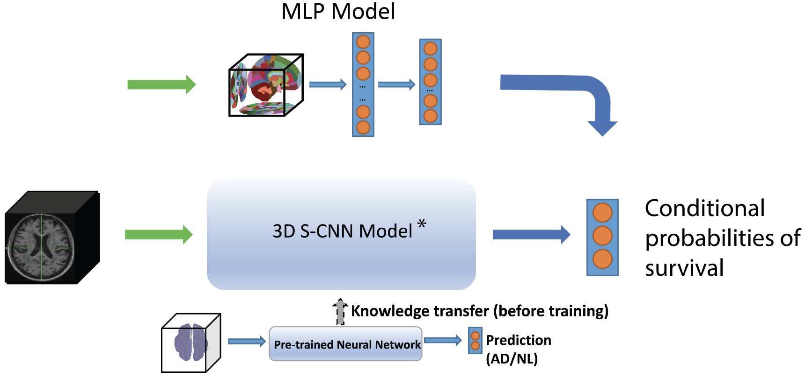

# Deep learning for risk-based stratification of cognitively impaired individuals

This work is published in *iScience* (https://doi.org/10.1016/j.isci.2023.107522).

## Introduction

We present here code and a breif review for the above paper. This code has principally been organized in the **main.py** file under mri_surv/



## Results

The table below shows the mean Concordance Index and Integrated Brier Score for different models and datasets. These metrics were averaged over 5-fold cross validation with standard deviation shown in parentheses. Concordance indices were averaged over the 3 time bins (24 months, 48 months, 108 months) for each fold. The MLPs were either trained with gray matter volumes from Neuromorphometrics cortical parcellations, averaged over hemispheres [GMV], or with gray matter volumes and CSF volumes from Neuromorphometrics cortical parcellations [GMV + CSF].

| Model/Dataset | ADNI Concordance Index | ADNI Integrated Brier Score | NACC Concordance Index | NACC Integrated Brier Score |
| --- | --- | --- | --- | --- |
| S-CNN | 0·756 (0·051) | 0·209 (0·050) | 0·676 (0·003) | 0·122 (0·013) |
| MLP, GMV | 0·731 (0·032) | 0·192 (0·057) | 0·707 (0·009)** | 0·108 (0·010) |
| Weibull | 0·743 (0·020) | 0·204 (0·049) | 0·696 (0·010)** | 0·105 (0·005) |
| CPH | 0·751 (0·049) | 0·182 (0·055) | 0·735 (0·014)* | 0·104 (0·006) |
| MLP, GMV + CSF | 0·729 (0·022) | 0·181 (0·044) | 0·699 (0·012)** | 0·114 (0·008) |

\* Pairwise paired t-test comparisons revealed significant differences, after Benjamini-Hochberg correction, in model performance between CPH and the other models as well as between CNN and the other models.  
\*\* MLP [GMV], MLP [GMV + CSF], and Weibull models had larger Concordance Indices in the NACC dataset compared with the S-CNN after pairwise paired t-test comparisons, p-values with Benjamini-Hochberg correction.

Abbreviations:  
S-CNN – survival convolutional neural network  
MLP – multilayer perceptron  
CPH – Cox proportional hazard model


## Installation & Requirements
To download the repo, use:
```bash
git clone https://github.com/vkola-lab/iscience2023.git
```

Please ensure your environment has following softwares installed:

```
python - 3.10.
python packages in '~/mri_surv/cgan_m/cnn/requirements.txt'.
```

We recommend using 'conda' to maintain the packages for python.

To install the packages, you can use following commands:
```bash
cd iscience2023/mri_surv/cgan_m/cnn/requirements.txt
pip install -r requirements.txt
```

## Metadata generation and image processing

Before running this code, please note that the following environments were used to run our code:
- env.yml: this is for the CNN and ViT models
- requirements.yml: this is for the code contained within main.py
- requirements_torch.yml: this is for the code corresponding to the MLP model (contained within the folder mri_surv/simple_mlp/

Please install these environments using conda

next, run from the commandline:
```
git clone https://github.com/vkola-lab/mri-surv
cd mri-surv/mri_surv
conda activate $ENVIRONMENT_NAME
```

## Please note, metadata generation instructions as below will only run if you have the raw data from NACC and ADNI in the correct folders. To obtain this data, please contact ADNI/NACC administrators and apply for data
We utilized the following data time stamps:
- For NACC: A 12042020 timestamp
- For ADNI:
  - We used a registry with a most recently updated time stamp of 2020-04-09
  - The most recent MRI3 datasheet update is 2020-04-04
  - The most recent Demographics datasheet update is 2020-09-09
  - The most recent DX summary sheet update is 2020-04-08
  - The most recent MMSE sheet update is 2020-04-01
  - CSF datasheets used were: UPENNBIOMK10_07_29_19.csv, UPENNBIOMK9_04_19_17.csv

With these files in metadata/data_raw/ADNI/, in order to generate the initial metadata sheet, please run:
`python main.py --makecsv 1`

The flag to run this on NACC is `--test 1`, so: `python main.py --makecsv 1 --test 1`. Note: NACC metadata files must be in the respective NACC folder.

In order to consolidate images and prune your data based on available ADNI images, (images are presumed to be located in a base directory at /data2/MRI_PET_DATA/raw_images/ having been unzipped), please run `python main.py --extractimg`, with or without `--moveraw 1` (this will relocate the raw images to a different directory under /data2/MRI_PET_DATA/).

Adding the flag `--process_image 1` will process the images in Matlab (we used version 2020, as noted in our paper, after downloading SPM12 and CAT12).

In order to generate the data used for pre-training, please run, from the mri_surv directory:
```
>>> from main import create_csv_time_unused, consolidate_dummy_data, ProcessImagesMRIDummy
>>> create_csv_time_unused()
>>> consolidate_dummy_data()
>>> pimd = ProcessImagesMRIDummy()
>>> pimd()
```

In order to generate the data used for AD, please run:
```
from main import consolidate_images_ad, create_csv_time,  ProcessImagesMRIAD
create_csv_time()
consolidate_images_ad()
pimd =  ProcessImagesMRIAD()
pimd()
```

## Next, run code for the MLP
For the MLP, please run the following code after activating the environment environment_torch.yml.
```
>>> main()
>>> from main import create_csv_time_unused, consolidate_dummy_data, ProcessImagesMRIDummy
>>> create_csv_time_unused()
>>> consolidate_dummy_data()
>>> pimd = ProcessImagesMRIDummy()
>>> pimd()
```

In order to generate the data used for AD, please run in the python console:
```
>>> from main import consolidate_images_ad, create_csv_time,  ProcessImagesMRIAD
>>> create_csv_time()
>>> consolidate_images_ad()
>>> pimd =  ProcessImagesMRIAD()
>>> pimd()
```
## Next, run code for the MLP
For the MLP, please run the following code after activating the environment environment_torch.yml, inside the python console:
```
>>> from simple_mlps.mlp_wrappers import main
>>> main()
```

## Run the final code for the CNN and ViT
For CNN, please CD into the ./mri-pet/mri_surv/cgan_m/cnn/ path, then you can
* Pre-train a CNN for transfer learning
```
CUBLAS_WORKSPACE_CONFIG=:4096:8 python pretrain_main.py
```
(The 'CUBLAS_WORKSPACE_CONFIG=:4096:8' is for reproducible results, which is optional)

You may change the training setting by change altering the code in this file correspondingly:
```python
def main():
    # configuration file for network hyperparameters
    config = read_json('./cnn_config.json')
    cnn_pre_config = config['cnn_pre']

    PWrapper = CNN_Wrapper_Pre
    print('pre-training networks for transfer learning...')

    # number of models to train (different initialization)
    cnn_repeat = 1

    # scan types, here we only use mri, but placeholders are available for potential extensions
    cnn_names = ['cnn_mri', 'cnn_amyloid', 'cnn_fdg']

    print('-'*100)
    for c_name in cnn_names:
        # modes += [c_name]
        cnn_pre_main(cnn_repeat, c_name+'_pre_2', cnn_pre_config, Wrapper=PWrapper)
        print('-'*100)
        break
    print('pre-training completed')
```

The 'cnn_config.json' contains following parameters (only showing part of the file):
```json
{
  "cnn": {
      "fil_num":              10,
      "drop_rate":            0.01,
      "batch_size":           10,
      "balanced":             0,
      "metric":               "CrossEntropy",
      "Data_dir":             "/data2/MRI_PET_DATA/processed_images_final_cox_noqc/brain_stripped_cox_noqc/",
      "learning_rate":        0.001,
      "train_epochs":         500
  },
  "mlp_parcellation": {
      "fil_num": 25,
      "drop_rate": 0.5,
      "learning_rate": 0.001,
      "weight_decay": 0.1,
      "train_epochs": 2000,
      "criterion": "cox_loss_orig",
      "dataset": "ParcellationData",
      "dataset_external": "ParcellationDataNacc",
      "model": "_MLP"
  }
}
```

This file and following '_main' files can be configured similarly

* Train a CNN for survival prediction
```
CUBLAS_WORKSPACE_CONFIG=:4096:8 python transfer_main.py
```
(You may edit this file by commenting out the loading part if you do not want transfer learning)

* (Optional) Train a Resnet-based CNN for survival prediction
```
CUBLAS_WORKSPACE_CONFIG=:4096:8 python res_main.py
```

For ViT, please CD into the ./mri-pet/mri_surv/vit/ path, then you can
* Pre-train a ViT for transfer learning
```
CUBLAS_WORKSPACE_CONFIG=:4096:8 python pre_main.py
```
* Train a ViT for survival prediction
```
CUBLAS_WORKSPACE_CONFIG=:4096:8 python vit_main.py
```
(You may edit this file by uncommenting the loading part if you want transfer learning)

For both CNN & ViT, uncommenting the \_dfs functions in the \_main.py files to generate data files for plotting survival curves

Then, in the main folder, open python and use following statements:
```
>>> from statistics.survival_plot_xz import main
>>> main()
```
The figures will be saved in ./mri-pet/mri_surv/figures/supplement_survival/

(Make sure you have all data needed before you generating the plots!)

## Statistics and plots
Finally, to compute statistics based on these results in addition to the MLP results, you may run `python main.py --stats 1`. Of note, you must run the MLP model script before running this code, or you will generate an error.

In addition, R files may be run using R studio or your R interpreter of choice. Please make sure to install the packages listed in our manuscript.

## FAQ
Q: I got 'ValueError: Cannot load file containing pickled data when allow_pickle=False' when training the CNN model?

A: In most cases, you can fix by running this command:
```
git lfs install
git lfs pull
```
